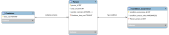

# Background
In the era of precision medicine, interoperability of biomedical data is essential for facilitating collaborative research and enhancing data-driven healthcare. The concept of a Minimum Data Set (MDS) has emerged as a collection of standardized data elements that allow clinical data sharing and support research. Biomedical data is often voluminous, complex, and sometimes ambiguous, which complicates generating actionable health indicators.

Our project addresses this challenge by developing a versatile web-based tool called **DataModel Converter**. This tool enables the conversion of cohort information to various biomedical MDS formats. Leveraging Flask or Streamlit, we offer an intuitive interface where users can select individuals from a cohort in a clinical database (e.g., OMOP CDM, OpenEHR) and effortlessly transform its structured data into multiple standard formats, such as B1MG Minimal Dataset for Cancer, BBMRI cohort definitions, OMOP cohorts, Phenopackets, and Beacon v2.

## Project Objectives

- **Design an interactive, user-friendly application** for cohort selection and data conversion.
- **Implement backend functionalities** to retrieve and manipulate data from clinical databases.
- **Develop semantic mappings** to preserve data integrity across models like OMOP CDM, OpenEHR, Phenopackets, B1MG, BBMRI, etc.
- **Ensure scalability and performance** to handle large-scale datasets.

## Scope and Vision

The **DataModel Converter** supports researchers in integrating and harmonising heterogeneous datasets for translational research, clinical studies, and personalized medicine. By automating data conversion, it eliminates manual manipulation and reduces data inconsistencies, saving time and ensuring data accuracy. Furthermore, it establishes consistent data structures and vocabulary mappings between source and target models.

### Importance of the Project

This project advances biomedical informatics, accelerating biomedical research and healthcare innovation. Researchers and clinicians can export clinical data from cohort definitions to widely-used data standards, promoting data reuse, cross-study comparisons, and reproducibility. This contributes to more robust scientific insights, improved patient care, and enhanced healthcare outcomes.

## Streamlined Data Transformation

Typically, data conversion tools require users to manually map data properties and perform an Extract, Transform, Load (ETL) process to transition data between models. Our implementation streamlines this process by utilising pre-existing mappings, eliminating the need for users to map properties manually. Users simply select individuals based on cohort criteria (e.g., sex, age range, disease) from their clinical data repository.

Using **OntoBridge** ([OntoBridge GitHub](https://github.com/InformaticaClinica/OntoBridge)), a semantic data mapping tool developed by our project leads, the selected data is converted to the desired data models. This enhances user efficiency and reduces the burden of data transformation, making the DataModel Converter a valuable resource for the biomedical informatics community. It fosters innovation, promotes the adoption of interoperable data standards, and supports advancements in translational research and clinical practice.

# Data Models to LINKML

## OMOP

A minimal schema for OMOP was created using **LinkML**. The following tutorial was used as a guide: [LinkML Tutorial](https://linkml.io/linkml/intro/tutorial01.html).

The following diagram models the OMOP data structure, with `Person` and `Condition_occurrence` classes to capture patient age, gender and disease condition. The `Container` class organises multiple `Person` instances.



**Minimal OMOP data model**

The LinkML tree structure provided guidance on linking LinkML classes, following the standard outlined here: [OHDSI Data Standardization](https://www.ohdsi.org/data-standardization/).

### Mapping Attributes for Age, Sex, and Disease

To map attributes such as **Age**, **Sex**, and **Disease**, the **OMOP v5.4 data model** was used to identify the appropriate attributes and classes to incorporate into the LinkML schema. For details on OMOP v5.4, see the documentation here: [OMOP v5.4 Data Model](https://ohdsi.github.io/CommonDataModel/cdm54.html#person).

The minimal LinkML schema can be found at the following path: `[INSERT RELATIVE PATH]`.

**Full OMOP data model**

We generated a full LinkML schema from OMOP v5.4. `[INSERT RELATIVE PATH]`

The full model was not used for the MVP app. 

How: Create a db and add tables with the OMOP DDL, then use `schemauto import-sql` to generate the LinkML. To lint, the following block needed to be added to the top of the file:

```
prefixes:
  linkml: https://w3id.org/linkml/
imports:
  - linkml:types
```

### Schema Validation

After creating the minimal LinkML OMOP schema, both test data and test data with errors were generated in YAML and JSON formats. These files were validated against the schema to confirm if expected validation errors were triggered. The commands used for validation were:

```bash
linkml-validate -s ../models/omop/omop_linkml_mvp.yml ../models/omop/test_data/test_person.yml 

linkml-validate -s ../models/omop/omop_linkml_mvp.yml ../models/omop/test_data/test_person.json

linkml-validate -s ../models/omop/omop_linkml_mvp.yml ../models/omop/test_data/test_person_bad.yml

linkml-validate -s ../models/omop/omop_linkml_mvp.yml ../models/omop/test_data/test_person_bad.json
```

This setup ensures that the schema can accurately validate test data and identify errors, maintaining data integrity within the OMOP model.

## FHIR 🔥 🔥 🔥 🔥 

### Documentation for Minimal FHIR Schema using LinkML

A minimal **FHIR** schema was created using **LinkML**, following a process similar to the one used for OMOP.

### Identifying FHIR Resources for Age, Sex, and Disease

To identify the relevant FHIR resources containing **Age**, **Sex**, and **Disease**, we referred to the FHIR resource list: [FHIR Resource List](https://www.hl7.org/fhir/resourcelist.html).

- **Age** and **Sex** attributes were found in the **Patient** resource.
- **Disease** information was found in the **Observation** resource.


The above diagram is the minimal FHIR schema. Instances of the `Patient` and `Condition` classes are organised through an overarching `Container` class. The `Patient` and `Condition` classes capture fields for age, gender, and disease. The `Condition` class references another entity, `CodeableConcept` which holds coding information about each condition.

Using this information, a minimal LinkML schema was created with **Patient** and **Observation** defined as classes.

The FHIR LinkML schema can be accessed here: `[insert repo link]`.

### Schema Validation

The FHIR LinkML schema was then tested using YAML and JSON files with both valid test data and test data containing intentional errors. The FHIR LinkML test data can be accessed here: `[insert repo link]`. This testing ensured that the schema correctly validated data and identified errors.

This validation process helps maintain data integrity within the FHIR model and supports reliable interoperability across biomedical data standards.

## B1MG

## Phenopackets

# General Cohort Model in LINKML

# Mapping of models

## OMOP and FHIR

The `australia-code/schema_builders/transformer.py` file contains functions to transform data between the Cohort meta-model to OMOP and FHIR. Additionally, it contains a function to transform FHIR to the cohort meta-model. 

All transformations use the `linkml-map` library to do the transformations. Mappings from cohort to the standard models required multiple intermediary transformations as the `linkml-map` is limited when it comes to transforming from 1 schema to multiple schemas. For
example, in the cohort schema, disease and age are in the same schema, whereas in FHIR they are stored in `Condition` and `Patient` respectively.

The transformation from FHIR to the cohort model uses a single transformation session, and utilises `linkml-map`'s dot notation expressions to access nested data.

# Extracting cohort data

# Webpage

A web portal was developed using **StreamLit**.

```sh
$ streamlit run app.py

# To run without automatically opening the browser
$ streamlit run app.py --server.headless true
```


This portal allows users to upload a `TSV` file which confirms to the cohort meta-model, select a standard format they would like to transform the data to, and download the result in either YAML or JSON format.

# Discussion

# Future work

# Acknowledgements


# References

