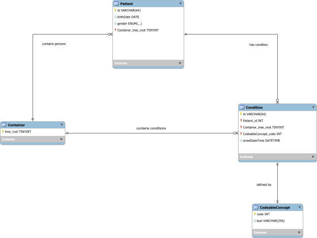

# Background

In the era of precision medicine, interoperability of biomedical data is essential for facilitating collaborative research and enhancing data-driven healthcare. The concept of a Minimum Data Set (MDS) has emerged as a collection of standardized data elements that allow clinical data sharing and support research. Biomedical data is often voluminous, complex, and sometimes ambiguous, which complicates generating actionable health indicators.

One approach to address this need is through the development of schema-based frameworks, such as the Linked Data Modeling Language (LinkML). LinkML is a modelling language for defining data schemas that are machine-readable, easily validated, and interoperable, thus supporting consistency and harmonization across biomedical datasets.

This project, as part of the ELIXIR Biohackathon 2024, aims to leverage LinkML to enhance data discoverability and interoperability within the ELIXIR community and beyond. Specifically, the team seeks to build on previous efforts in data harmonization by developing and testing LinkML schemas with common data models used dayly. Our approach focuses on schema integration, validation to LinkML and then mapping to the other LinkML schemas.

The development of these schemas aligns with the goals of ELIXIR and similar life science infrastructures to promote data accessibility, reliability, and integration across borders and research domains. To do so, we have chosen the OMOP CDM, Phenopackets, FHIR and B1MG models as a first models to try our approacj. By implementing standardized schema models, we aim to create a robust framework for reusability of health information, ultimately supporting collaborative research and innovation in the life sciences.

## Project Objectives

- **Design an interactive, user-friendly application** for cohort selection and data conversion.
- **Implement backend functionalities** to retrieve and manipulate data from clinical databases.
- **Develop semantic mappings** to preserve data integrity across models like OMOP CDM, Phenopackets, B1MG and FHIR.
- **Ensure scalability and performance** to handle large-scale datasets.

## Scope and Vision

The **DataModel Converter** supports researchers in integrating and harmonising heterogeneous datasets for translational research, clinical studies, and personalized medicine. By automating data conversion, it eliminates manual manipulation and reduces data inconsistencies, saving time and ensuring data accuracy. Furthermore, it establishes consistent data structures and vocabulary mappings between source and target models.

### Importance of the Project

This project advances biomedical informatics, accelerating biomedical research and healthcare innovation. Researchers and clinicians can export clinical data from cohort definitions to widely-used data standards, promoting data reuse, cross-study comparisons, and reproducibility. This contributes to more robust scientific insights, improved patient care, and enhanced healthcare outcomes.

## Streamlined Data Transformation

Typically, data conversion tools require users to manually map data properties and perform an Extract, Transform, Load (ETL) process to transition data between models. Our implementation streamlines this process by utilising pre-existing mappings, eliminating the need for users to map properties manually. Users simply select individuals based on cohort criteria (in this case only sex, age range, disease for demonstration purposes) from their clinical data repository.

# Data Models to LINKML

Here we describe the models used in the BioHackaton project and its model in LinkML. The following tutorial was used as a guide: [LinkML Tutorial](https://linkml.io/linkml/intro/tutorial01.html). 

After creating the minimal LinkML schema, both test data and test data with errors were generated. These files were validated against the schema to confirm if expected validation errors were triggered. 

## OMOP

A minimal schema for OMOP was created using **LinkML**. 

The following diagram models the OMOP data structure, with `Person` and `Condition_occurrence` classes to capture patient age, gender and disease condition. The `Container` class organises multiple `Person` instances.


**Minimal OMOP data model**

The LinkML tree structure provided guidance on linking LinkML classes, following the standard outlined here: [OHDSI Data Standardization](https://www.ohdsi.org/data-standardization/).

### Mapping Attributes for Age, Sex, and Disease

To map attributes such as **Age**, **Sex**, and **Disease**, the **OMOP v5.4 data model** was used to identify the appropriate attributes and classes to incorporate into the LinkML schema. For details on OMOP v5.4, see the documentation here: [OMOP v5.4 Data Model](https://ohdsi.github.io/CommonDataModel/cdm54.html#person).

The minimal LinkML schema can be found at the following path: `[INSERT RELATIVE PATH]`.

**Full OMOP data model**

We generated a full LinkML schema from OMOP v5.4. `[INSERT RELATIVE PATH]`

The full model was not used for the MVP app. 

How: Create a db and add tables with the OMOP DDL, then use `schemauto import-sql` to generate the LinkML. To lint, the following block needed to be added to the top of the file:

```
prefixes:
  linkml: https://w3id.org/linkml/
imports:
  - linkml:types
```

### Schema Validation

After creating the minimal LinkML OMOP schema, both test data and test data with errors were generated in YAML and JSON formats. These files were validated against the schema to confirm if expected validation errors were triggered. The commands used for validation were:

```bash
linkml-validate -s ../models/omop/omop_linkml_mvp.yml ../models/omop/test_data/test_person.yml 

linkml-validate -s ../models/omop/omop_linkml_mvp.yml ../models/omop/test_data/test_person.json

linkml-validate -s ../models/omop/omop_linkml_mvp.yml ../models/omop/test_data/test_person_bad.yml

linkml-validate -s ../models/omop/omop_linkml_mvp.yml ../models/omop/test_data/test_person_bad.json
```

This setup ensures that the schema can accurately validate test data and identify errors, maintaining data integrity within the OMOP model.

## FHIR 🔥 🔥 🔥 🔥 

### Documentation for Minimal FHIR Schema using LinkML

A minimal **FHIR** schema was created using **LinkML**, following a process similar to the one used for OMOP.

### Identifying FHIR Resources for Age, Sex, and Disease

To identify the relevant FHIR resources containing **Age**, **Sex**, and **Disease**, we referred to the FHIR resource list: [FHIR Resource List](https://www.hl7.org/fhir/resourcelist.html).

- **Age** and **Sex** attributes were found in the **Patient** resource.
- **Disease** information was found in the **Observation** resource.



The above diagram is the minimal FHIR schema. Instances of the `Patient` and `Condition` classes are organised through an overarching `Container` class. The `Patient` and `Condition` classes capture fields for age, gender, and disease. The `Condition` class references another entity, `CodeableConcept` which holds coding information about each condition.

Using this information, a minimal LinkML schema was created with **Patient** and **Observation** defined as classes.

The FHIR LinkML schema can be accessed here: `[insert repo link]`.

### Schema Validation

The FHIR LinkML schema was then tested using YAML and JSON files with both valid test data and test data containing intentional errors. The FHIR LinkML test data can be accessed here: `[insert repo link]`. This testing ensured that the schema correctly validated data and identified errors.

This validation process helps maintain data integrity within the FHIR model and supports reliable interoperability across biomedical data standards.

## B1MG

The Beyond 1+ Million Genomes (B1MG) Minimal Dataset for Cancer [https://doi.org/10.1101/2023.10.07.561259] is the base model used for the GDI Cancer data. The model can be found [here](https://www.biorxiv.org/content/biorxiv/early/2023/10/10/2023.10.07.561259/DC1/embed/media-1.xlsx?download=true).

The model has 140 variables, where many of them are mandatory. The LinkML model with the mandatory variables look like the following image.


In order to avoid the cohort mapping to all the mandatory variables, only the desired three variables are mapped. In this case, the variables `Birt_Year`, `Sex_at_Birth` from the `Patient` section and `Definition` from the `Disease` section are defined.


As it is done in the other models, the classes are mapped to a meta class `Container`.

The minimal B1MG LinkML schema can be accessed [here](https://github.com/bsc-health-data/linkml-biohackathon-2024/blob/main/linkmlModels/B1MG/minimalB1MGModel.yaml).

The B1MG LinkML schema with all the mandatory variables can be accessed [here](https://github.com/bsc-health-data/linkml-biohackathon-2024/blob/main/linkmlModels/B1MG/B1MGModel.yaml).

## Phenopackets

[Phenopackets](https://www.ga4gh.org/product/phenopackets/) is a standard of the GA4GH for sharing disease and phenotype information.

The LinkML model created in this project is based on the one found in [linkml-phenopackets repository](https://github.com/cmungall/linkml-phenopackets/). This model has the variables needed for our project, so in order to reduce overlap, we have use them:

- `age`: Age property from the `timeAtLastEncounter` property from the `patent` section.
- `sex`: Sex of the patient.
- `diseases`: Property having the ontology and label of the disease.

The full schema can be seen in the [pages of the repository](https://cmungall.github.io/linkml-phenopackets/).


# General Cohort Model in LINKML

# Mapping of models

## OMOP and FHIR

The `australia-code/schema_builders/transformer.py` file contains functions to transform data between the Cohort meta-model to OMOP and FHIR. Additionally, it contains a function to transform FHIR to the cohort meta-model. 

All transformations use the `linkml-map` library to do the transformations. Mappings from cohort to the standard models required multiple intermediary transformations as the `linkml-map` is limited when it comes to transforming from 1 schema to multiple schemas. For
example, in the cohort schema, disease and age are in the same schema, whereas in FHIR they are stored in `Condition` and `Patient` respectively.

The transformation from FHIR to the cohort model uses a single transformation session, and utilises `linkml-map`'s dot notation expressions to access nested data.

# Extracting cohort data

# Webpage

A web portal was developed using **StreamLit**.

```sh
$ streamlit run app.py

# To run without automatically opening the browser
$ streamlit run app.py --server.headless true
```


This portal allows users to upload a `TSV` file which confirms to the cohort meta-model, select a standard format they would like to transform the data to, and download the result in either YAML or JSON format.

# Discussion

# Future work

# Acknowledgements


# References

